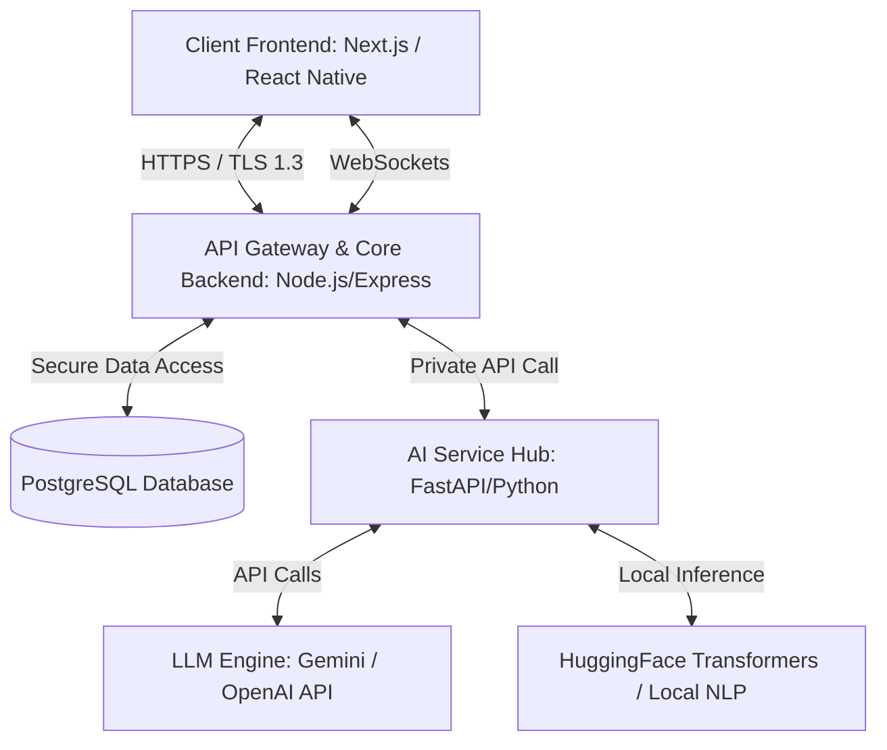
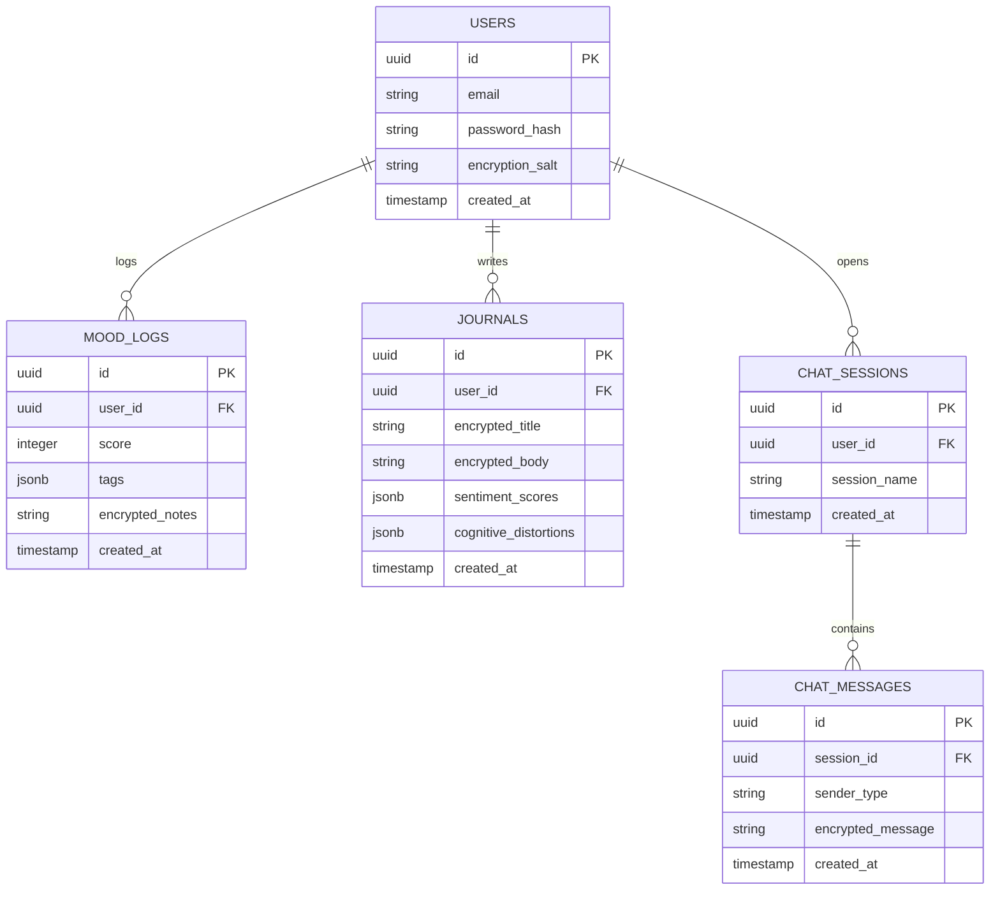

# Software Architecture Document (SAD)

## System Architecture Overview

**SereneMind** is designed with a highly decoupled, modular microservice architecture. This separation of concerns ensures that the platform is scalable, secure, and optimized for rapid parallel development by a 5-person engineering team.



---

## 1. Modular Architecture Tiers

### 1.1. Client Tier (Frontend)
*   **Tech Stack**: Next.js (App Router) utilizing TypeScript and custom vanilla CSS modules conforming to the `mental_health_chatbot_color_framework.md`.
*   **Project Structure (Next.js App Router)**:
    *   `/app/page.tsx`: Landing Page
    *   `/app/(auth)/login/page.tsx`: Login/Register Page
    *   `/app/(main)/dashboard/page.tsx`: Main Dashboard
    *   `/app/(main)/chatbot/page.tsx`: Chatbot Page
    *   `/app/(main)/journaling/page.tsx`: Journaling Page
    *   `/app/(main)/history/page.tsx`: History & Summaries Page
    *   `/app/(main)/analysis/page.tsx`: Analysis Page
    *   `/app/(main)/crisis-sos/page.tsx`: Crisis SOS System
    *   `/app/(main)/exercises/page.tsx`: Recommended Exercises Page
*   **Key Responsibilities**:
    *   Rendering fluid, calming UI components based on the established color framework.
    *   Managing local authentication state and encrypted local caching.
    *   Establishing persistent WebSockets for low-latency streaming chat interactions.

### 1.2. Core Backend Tier (API Gateway)
*   **Tech Stack**: Node.js with Express & TypeScript.
*   **Key Responsibilities**:
    *   **Authentication & Session Management**: JWT-based authentication with high-entropy session keys.
    *   **Data Gatekeeper**: Standard CRUD endpoints for User Profiles, Mood Logs, and Self-Care Resources.
    *   **Security Orchestrator**: Manages field-level encryption/decryption keys using AWS KMS or HashiCorp Vault. Decrypts data *only* when accessed by an authenticated, authorized owner.
    *   **Event Broker**: Serves as the primary bridge between the client and the internal AI Service Hub.

### 1.3. AI Service Hub (Intelligence Layer)
*   **Tech Stack**: Python with FastAPI, LangChain/LangGraph, and PyTorch.
*   **Key Responsibilities**:
    *   **Safety Pipeline (The Sentinel)**: Runs primary input text through local regex filters and lightweight BERT-based classification models to detect immediate crisis indicators (e.g., suicide, self-harm).
    *   **Cognitive Analysis**: Leverages NLP pipelines to extract sentiment percentages and identify specific cognitive distortions from journal entries.
    *   **Conversational Agent Engine**: Orchestrates LLM prompt pipelines, feeding CBT/DBT behavioral rules, user emotional context, and system safety constraints into the model.

---

## 2. Database Schema & Data Models

We utilize **PostgreSQL** as our primary relational database to ensure high integrity, transactional consistency, and native JSONB support for complex analytics data.



### 2.1. Cryptographic Isolation Strategy
To maintain absolute compliance and prevent data exposure in the event of a database compromise:
*   Columns designated as `encrypted_` (e.g., `JOURNALS.encrypted_body`, `CHAT_MESSAGES.encrypted_message`) are encrypted using **AES-256-GCM**.
*   The encryption key is derived using the user’s master session key combined with the unique database `encryption_salt`.
*   At no point does the raw text of a journal entry or chat message sit in plain-text inside the persistent storage layer.

---

## 3. Modular API Design & System Contracts

To enable the frontend and backend engineers to build in lock-step, the following precise API contracts are established.

### 3.1. Authentication Interface
`POST /api/auth/register`
*   **Request Payload**:
    ```json
    {
      "email": "user@example.com",
      "password": "SecurePassword123!"
    }
    ```
*   **Response Payload (201 Created)**:
    ```json
    {
      "status": "success",
      "token": "eyJhbGciOiJIUzI1NiIsInR5cCI6IkpXVCJ9...",
      "user": {
        "id": "a3b9c8d7-e6f5-4a3b-2c1d-0e9f8a7b6c5d",
        "email": "user@example.com"
      }
    }
    ```

### 3.2. Mood Logging Interface
`POST /api/moods`
*   **Request Payload**:
    ```json
    {
      "score": 7,
      "tags": ["social", "exercise"],
      "notes": "Had a nice run in the morning and met a friend for lunch."
    }
    ```
*   **Response Payload (201 Created)**:
    ```json
    {
      "status": "success",
      "mood_log": {
        "id": "f8d7c6b5-e4d3-c2b1-a0e9-f8d7c6b5a4d3",
        "score": 7,
        "tags": ["social", "exercise"],
        "created_at": "2026-05-22T09:45:00Z"
      }
    }
    ```

### 3.3. AI Journal Analysis Interface (Internal - Node.js to FastAPI)
`POST /ai/journal/analyze`
*   **Request Payload**:
    ```json
    {
      "entry_text": "I feel like I'm going to fail my final exams, no matter what I do. It's completely hopeless."
    }
    ```
*   **Response Payload (200 OK)**:
    ```json
    {
      "sentiment": {
        "anxiety": 0.70,
        "sadness": 0.20,
        "hopefulness": 0.10
      },
      "cognitive_distortions": [
        {
          "type": "Catastrophizing",
          "matched_text": "I'm going to fail my final exams, no matter what I do",
          "reframe_prompt": "You feel like failing is inevitable. Let's look at your past exam preparation. Is there evidence that you can pass?"
        }
      ]
    }
    ```

### 3.4. Real-Time Chat Interface (WebSocket Protocols)
When client connects to `/ws/chat?token=JWT_TOKEN`:

#### A. Client sends Message Ingestion Frame
```json
{
  "event": "client_message",
  "data": {
    "session_id": "c7b6a5e4-d3c2-b1a0-e9f8-d7c6b5a4d3c2",
    "message": "I'm feeling really stressed about my upcoming project review."
  }
}
```

#### B. Server sends Safety Status Frame (Instant)
```json
{
  "event": "safety_check",
  "data": {
    "is_safe": true,
    "crisis_detected": false
  }
}
```

#### C. Server sends Streaming AI Response (Incremental Chunks)
```json
{
  "event": "ai_chunk",
  "data": {
    "chunk": "I hear how much pressure you're putting on yourself. ",
    "is_final": false
  }
}
```
