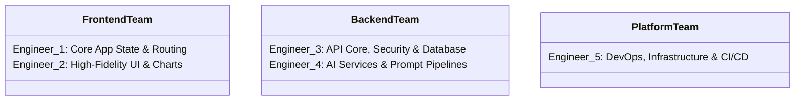

# Team Development & Workflow Guidelines

To build **SereneMind** rapidly and keep the codebase highly modular, this document establishes a **5-person development workflow**. By aligning on clear ownership boundaries, repo layouts, and contract-first workflows, the team can avoid merge conflicts and deliver the product efficiently.

---

## 1. Team Roles & Responsibility Matrix

With 5 engineers, we divide ownership by architectural modules so everyone can code independently with minimal blockers.



### 1.1. Client Engineering (Frontend)
*   **Engineer 1: Frontend Core & App State (Frontend Lead)**
    *   *Core Ownership*: Client shell, navigation routers, authentication routing blocks, global state management (Zustand or Redux Toolkit), and secure local session handling.
    *   *Key Task*: Establish the WebSocket client connection wrappers and local SQLite/SecureStore state for offline buffering.
*   **Engineer 2: UI Component & Data Visualization Specialist**
    *   *Core Ownership*: High-fidelity glassmorphic cards, soothing dark mode layouts using custom HSL styles, responsive screens, interactive mood logs, progress graphs (Chart.js or SVG-based components), and guided meditation audio controllers.
    *   *Key Task*: Develop the interactive circular mood check-in slider and real-time chatting bubble animations.

### 1.2. Service Engineering (Backend & AI)
*   **Engineer 3: Core API Gateway & Database Engineer (Backend Lead)**
    *   *Core Ownership*: Express/Node.js API pipeline, Prisma ORM or raw SQL schema migrations, JWT auth system, security event logs, and field-level encryption/decryption modules (AES-256-GCM).
    *   *Key Task*: Write the middleware that intercepts raw text inputs and securely coordinates payload transmission to the AI Service.
*   **Engineer 4: Cognitive AI & Agent Systems Engineer**
    *   *Core Ownership*: FastAPI Python microservice, LLM prompt engineering, local BERT safety intent classifiers, and sentiment tracking models.
    *   *Key Task*: Build the safety processing pipeline (The Sentinel) and write the prompt template schemas for Cognitive Behavioral Therapy (CBT) reflection.

### 1.3. Infrastructure & Assurance (DevOps & QA)
*   **Engineer 5: DevOps, QA & Compliance Engineer**
    *   *Core Ownership*: Local Docker Compose environments, CI/CD pipelines (GitHub Actions), end-to-end integration test suites, security auditing (verifying encrypted databases), and load testing WebSocket links.
    *   *Key Task*: Standardize the single-command startup script (`docker-compose up`) to ensure all developers can instantly run local replicas of the complete microservice network.

---

## 2. Standardized Repository Structure

A multi-package structure isolates dependencies and keeps code modular:

```text
/serenemind-root
│
├── /client                 # NEXT.JS OR REACT NATIVE APP (Engineer 1 & 2)
│   ├── /components         # Highly reusable, atomic UI (Cards, Sliders, Charts)
│   ├── /screens            # App views (Dashboard, Chat, Journal, Analytics)
│   ├── /state              # Global state management (Zustand stores)
│   ├── /styles             # Global design tokens (HSL variables, typography)
│   └── package.json
│
├── /server                 # CORE EXPRESS BACKEND API (Engineer 3)
│   ├── /src/config         # DB configurations, environment setup
│   ├── /src/controllers    # Endpoint handlers (Auth, Mood, Resources)
│   ├── /src/middleware     # Security checks, encryption handlers
│   ├── /src/models         # Database schemas
│   └── package.json
│
├── /ai_service             # FASTAPI MICROSERVICE (Engineer 4)
│   ├── /app/core           # Configs, LLM prompt templates
│   ├── /app/pipelines      # Safety classifier, sentiment and distortion analysis
│   ├── /app/routes         # Microservice API routes
│   └── requirements.txt
│
├── /Docs                   # SYSTEM SPECIFICATION DOCUMENTS
│   ├── /assets             # High-fidelity UI mock-ups & diagrams
│   └── PRD.md, ARCHITECTURE.md, WIREFRAMES.md
│
├── docker-compose.yml      # Orchestrates all services for local development
└── README.md
```

---

## 3. The "Contract-First" Mocking Workflow

To ensure frontend developers are never blocked waiting on backend features, the team must practice **Contract-First Development**:

1.  **Define Contracts**: Engineers 1, 3, and 4 collaborate to agree on API/WebSocket JSON structures (as defined in `ARCHITECTURE.md`).
2.  **Generate Mock Endpoints**: Engineer 3 implements simple dummy endpoints in the core server immediately returning fixed JSON payloads (mock objects).
3.  **Parallel Building**:
    *   *Frontend Engineers* immediately integrate actual API calls against the mock backend, configuring real-life state handlers, dashboards, and charts.
    *   *AI Engineers* build FastAPI endpoints returning simulated sentiment results so backend API gateway flows can be completed.
    *   *Backend Engineers* work on the actual database queries, encryption systems, and real API endpoints in parallel.
4.  **Final Binding**: Once the real database and AI integration code is completed, Engineer 5 executes integration scripts to swap core configurations from Mock mode to Active mode.

---

## 4. Git Branching & Integration Policy

To maintain repository sanity and prevent code regression:

*   **Branching Convention**:
    *   `main`: Always stable, fully tested, matches staging/production builds.
    *   `develop`: The integration branch for current sprint features.
    *   `feature/<jira-id>-short-desc`: Developer branch (e.g., `feature/sm-12-mood-slider`).
    *   `hotfix/<jira-id>-short-desc`: Production emergency patches.
*   **Merge Request Protocol**:
    *   No developer merges directly to `develop` or `main`.
    *   Every Pull Request (PR) requires a minimum of **one** approving review from a corresponding team member (e.g., frontend reviews frontend, AI reviews AI).
    *   All automated CI/CD checks (linting, TypeScript compiling, Python pytest suites) must pass before merging.
