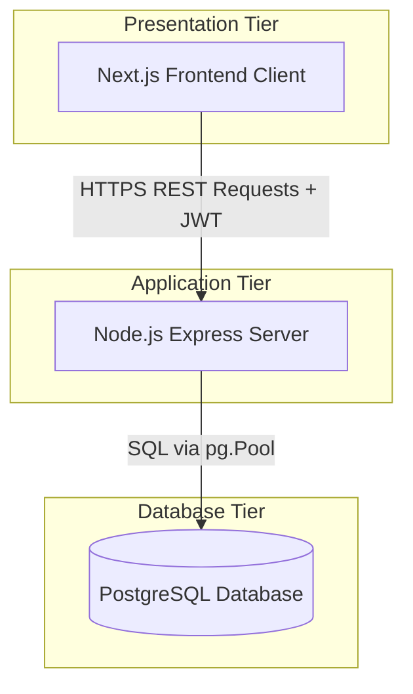
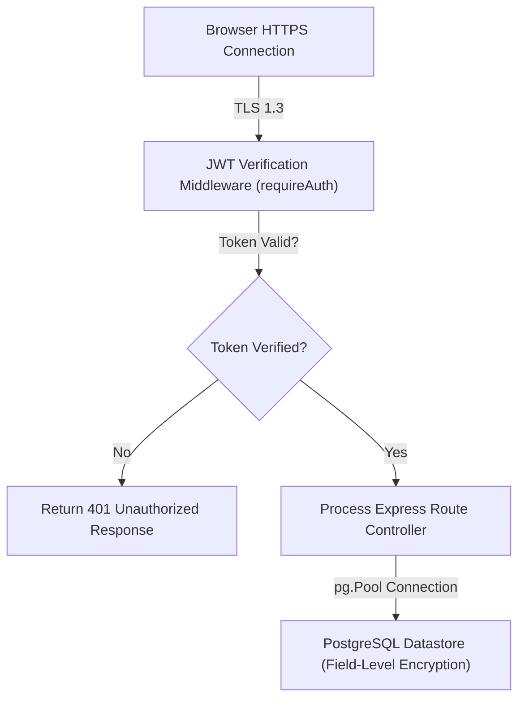

# High-Level Design (HLD)
## Project Name: SereneMind
### Document Version: 1.0.0
### Date: May 22, 2026

---

## 1. Document Overview

### 1.1 Purpose
This High-Level Design (HLD) document outlines the architectural blueprints, system configurations, communication interfaces, and routing mechanisms for **SereneMind**. It defines how front-end views, back-end APIs, and the PostgreSQL datastore integrate into a secure, responsive mental health support ecosystem.

### 1.2 Scope
This HLD details:
- System Tiers (Client, Server, Database).
- Component relationships and REST API routing schemas.
- High-level security mechanisms, JWT authentication flows, and CORS policies.
- Database connection pooling strategy.

---

## 2. System Architecture Overview

SereneMind implements a **3-Tier Web Architecture** built on modern Javascript/Typescript frameworks and PostgreSQL.

* **Diagram Explanation**: Shows the classic 3-Tier Architecture of SereneMind: client-side views interact securely with the API application layer using REST requests backed by JWT authentication headers, and the API tier queries data layers via PostgreSQL pool connections.

### 2.1 Presentation Tier (Frontend Client)
- **Framework**: Next.js (App Router setup).
- **Core State Modules**:
  - `AuthContext`: Tracks current logged-in user profiles, handles login/registration actions, manages JWT token assignment/revocation, and routes users to authenticated dashboards.
- **Components**:
  - `Header`: Displays the daily streak pill (fetching `/api/wellness/streak`), active theme settings (Sunlight/Moonlight toggle), and profile initials.
  - `Sidebar`: Handles application routing and features a polished, error-themed Log Out trigger.
  - `Mascot`: Renders Sparky the Companion Hamster dynamically matching egg hatching levels and mood/personality stats.
- **Routing**: Client-side Next.js filesystem-based routing (`/dashboard`, `/chatbot`, `/journaling`, `/history`, `/analysis`, `/exercises`, `/profile`, `/crisis-sos`).

### 2.2 Application Tier (Express API Server)
- **Runtime**: Node.js with Express.
- **Language**: TypeScript (strict compilation).
- **CORS Configuration**: Restricted to allow incoming cross-origin traffic from specific frontend ports (typically `3000` or `3002`).
- **Auth Middleware**: `requireAuth` extracts the Bearer token from authorization headers, validates it using a standard JWT verification library, and injects user context (`req.user`) into controller routes.

### 2.3 Database Tier (PostgreSQL Datastore)
- **Database Engine**: PostgreSQL 16.
- **Connection Model**: Client calls use Node's `pg` connection pool (`Pool` instance) managed inside `server/src/db.ts` to coordinate concurrent transactions efficiently.

---

## 3. Component Interaction & Routing Map

The application maps specific client-side features directly to backend routes.

| Frontend Page / Component | Action Trigger | HTTP Method | Express API Endpoint | DB Tables Affected |
| :--- | :--- | :--- | :--- | :--- |
| **Login / Register** | Form Submission | `POST` | `/api/auth/register` or `/login` | `users` |
| **Header** (Streak Pill) | Mount / Path change | `GET` | `/api/wellness/streak` | `wellness_logs` |
| **Header** (Profile Avatar) | Mount / Updates | `GET` | `/api/mascot` | `mascots` |
| **Dashboard** (Mascot Level) | Mount / Log actions | `GET` | `/api/wellness` | `wellness_logs` |
| **Dashboard** (Mood check-in) | Select Mood Emoji | `POST` | `/api/wellness` | `wellness_logs`, `mood_logs` |
| **Chatbot** | Send Message | `POST` | `/api/chats` | `chat_messages`, `wellness_logs` |
| **Journaling** | Auto-save idle | `POST` | `/api/journals` | `journals`, `wellness_logs` |
| **History** | Load Timeline | `GET` | `/api/wellness` | `wellness_logs` |
| **History** | Delete Log Item | `DELETE` | `/api/wellness/:id` | `wellness_logs` |
| **Analysis** | Heatmap render | `GET` | `/api/calendar` | `mood_calendar` |
| **Exercises** | Complete breathing | `POST` | `/api/exercises` | `exercise_logs`, `wellness_logs` |
| **Profile** | Save clinical details | `POST` | `/api/mascot/persona` | `user_personas` |

---

## 4. Security Architecture

To protect user confidentiality, SereneMind incorporates safety controls at every layer:

* **Diagram Explanation**: Highlights the multi-layered security verification pipeline. All browser traffic traverses TLS 1.3 encryption boundaries and is evaluated by the custom `requireAuth` route interceptor before execution by controller logic and query matching in database records.

### 4.1 Communication Encryption
- **TLS 1.3**: All requests pass through Secure Sockets Layer/Transport Layer Security to avoid man-in-the-middle exploits.
- **CORS policies**: REST server explicitly rejects requests originating from unauthorized domain namespaces.

### 4.2 API Authentication
- **Token Signing**: Backend uses HMAC SHA-256 algorithms to sign session payloads.
- **Verification Middleware**: The `requireAuth` handler intercepts requests to protected routes, returning a standard `401 Unauthorized` response if the JWT is invalid or missing.

### 4.3 Data Layer Protection
- **Parameterized SQL**: All database queries utilize parameterized input array parameters (e.g. `[userId, tz]`) to prevent SQL Injection vectors.
- **Cascade Purges**: User deletion routes map clean cascading triggers to remove child rows immediately across dependent tables, meeting GDPR standards.
