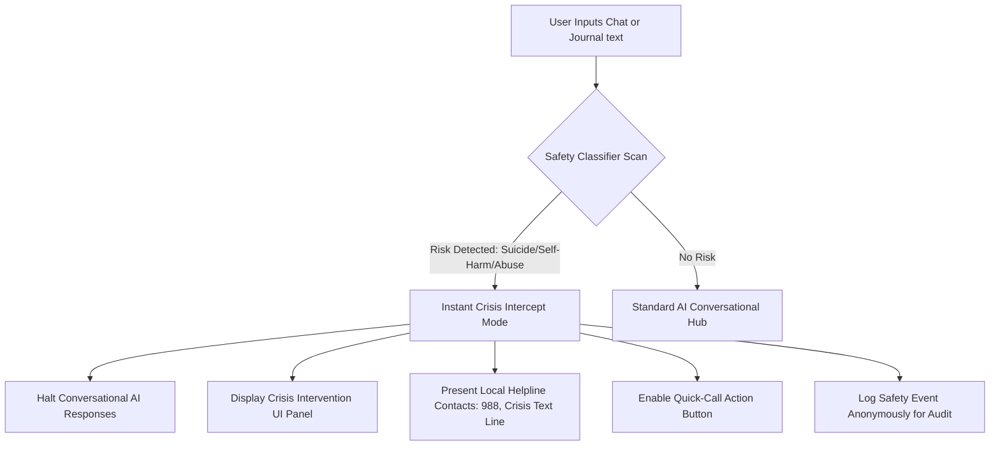

# Product Requirements Document (PRD)

## Project Name: **SereneMind**
### Document Version: 1.0.0  
### Status: Approved  
### Target Release: Q3 2026

---

## 1. Executive Summary & Vision

**SereneMind** is a state-of-the-art, AI-driven mental health support ecosystem. It is designed to bridge the gap between human therapy sessions and daily emotional struggles by providing a 24/7 empathetic conversational companion, intelligent mood analytics, and evidence-based self-care tools. 

> [!IMPORTANT]
> **SereneMind is NOT a clinical tool or a replacement for professional medical treatment.** It acts as a supportive companion using Cognitive Behavioral Therapy (CBT) and Dialectical Behavior Therapy (DBT) frameworks to help users understand their emotional patterns, self-regulate, and build emotional resilience.

### Vision Statement
*To democratize mental health support by creating a highly secure, empathetic, and intuitive companion that empowers individuals to navigate daily stresses with privacy and clarity.*

---

## 2. Target Audience & User Personas

1. **The Stressed Professional (e.g., Maya, 28)**: High-pressure job, experiences frequent mild anxiety and sleep disturbances. Needs quick, accessible mindfulness exercises and mood-correlation tracking to identify stress triggers.
2. **The Expressive Journaler (e.g., Alex, 21)**: College student who uses writing to process emotions. Needs a private, secure journal with AI sentiment insights to identify cognitive distortions (e.g., black-and-white thinking) in their writing.
3. **The Night Owl in Crisis (e.g., Liam, 35)**: Struggles with lonely late-night periods where negative thoughts build up. Needs a responsive, empathetic AI chat companion to talk through feelings and prevent escalation.

---

## 3. Core Feature Specifications & App Pages

The application is structured into 9 core pages/workspaces:

### 3.1. Landing Page (Home)
*   **Description**: The entry point introducing the SereneMind vision.
*   **Key Capabilities**: Value proposition, clinical disclaimers, and clear calls to action for registration or login.

### 3.2. Authentication (Login/Register)
*   **Description**: Secure access portal.
*   **Key Capabilities**: Standard login, anonymous profile creation, and HIPAA-compliant password/session management.

### 3.3. Main Dashboard
*   **Description**: The central hub with a dynamic sidebar for navigation.
*   **Key Capabilities**: Overview of the user's current mood, quick interactions, and access to all other application modules via the sidebar.

### 3.4. Chatbot Page
*   **Description**: The empathetic conversational interface.
*   **Key Capabilities**: Real-time CBT-based chat with typing indicators and mood tag detection.

### 3.5. Journaling Page
*   **Description**: A digital journal for free-form reflection.
*   **Key Capabilities**: Text entry with auto-save and initial sentiment tagging.

### 3.6. History Page
*   **Description**: A timeline of past interactions.
*   **Key Capabilities**: Lists past journal entries and chat sessions. Features an AI generator that produces monthly and yearly summaries of the user's emotional journey.

### 3.7. Analysis Page
*   **Description**: Deep-dive analytics dashboard.
*   **Key Capabilities**: Mood tracking charts, heatmaps, and correlation insights (e.g., sleep vs. stress).

### 3.8. Crisis SOS
*   **Description**: High-priority immediate help interface.
*   **Key Capabilities**: Triggered automatically or manually, halts AI conversational generation, and provides immediate emergency contacts and coping mechanisms.

### 3.9. Exercise Page
*   **Description**: Dynamic self-care recommendations.
*   **Key Capabilities**: Suggests breathing exercises, meditations, or grounding techniques based directly on the user's recent chatbot and journaling history.

---

## 4. Safety & Crisis Management Protocol (CRITICAL)

The safety of our users is paramount. SereneMind must implement a multi-layered safety net to detect and intercept clinical crises in real time.

### 4.1. Real-Time Safety Classifier
*   **Scanning**: Every user-submitted message in the chat and journal is scanned immediately before processing.
*   **Trigger Keywords & Intent**: Matches specific clinical danger indicators including suicide, self-harm, eating disorders, physical abuse, and violence.
*   **Hybrid Matching**: Uses quick Regex matching for explicit trigger terms combined with semantic LLM/NLP classification to detect subtle self-harm intent or severe despair.

### 4.2. Crisis Intercept Mode
*   **UI Transition**: The chat input is temporarily restricted. The active conversational agent is paused to prevent the AI from generating inappropriate clinical advice.
*   **Resources Panel**: A dedicated, prominent, soothing red/pink interface overlays the screen showing:
    *   **Crisis Lifeline (988)**: Direct quick-dial button.
    *   **Crisis Text Line (741741)**: Direct SMS launch button.
    *   **International Helplines**: Dropdown to find numbers based on geo-location.
    *   **Personal Safety Plan**: Quick access to the user's custom coping strategies and emergency contacts.
*   **Re-activation**: Conversation can only resume once the user explicitly clicks "I am safe and ready to return to chat," while the safety card remains permanently accessible via a dedicated quick-link button.

---

## 5. Security, Privacy & Compliance

Mental health data is extremely sensitive. SereneMind must be engineered with **Privacy by Design** principles.

### 5.1. HIPAA & GDPR Compliance
*   **HIPAA (Health Insurance Portability and Accountability Act)**:
    *   Implement field-level encryption for Protected Health Information (PHI) in databases.
    *   Detailed audit logs tracking every read/write operation on PHI.
    *   Strict Access Control Policies for any admin/support accounts.
    *   Execute Business Associate Agreements (BAAs) with all API and infrastructure providers.
*   **GDPR (General Data Protection Regulation)**:
    *   *Right to be Forgotten*: Instant and absolute user-initiated account deletion that purges database fields and remote back-ups.
    *   *Right of Access*: One-click download of all user data in a portable JSON format.
    *   *Purpose Limitation*: Consent checkboxes specifically detailing that chats and journals are never used to train global LLM models.

### 5.2. Data Encryption Standard
*   **In Transit**: TLS 1.3 encryption across all client-server communication.
*   **At Rest**: AES-256 database-level encryption.
*   **Sensitive Fields**: Journal texts, chat logs, and personal details must be encrypted with specialized cryptographic keys stored securely in a Key Management Service (KMS), completely detached from primary database servers.
*   **Anonymized Profile Option**: Allow users to register with just an encrypted email or complete local-only storage (no cloud back-ups) for absolute privacy.

---

## 6. Success Metrics & Product KPIs

To measure the health and impact of SereneMind, the team will monitor:

| Metric Category | Key Performance Indicator (KPI) | Target Baseline |
| :--- | :--- | :--- |
| **Engagement** | Daily Active Users (DAU) / Monthly Active Users (MAU) | > 0.40 |
| **Retention** | Day 30 Retention | > 35% |
| **Clinical Impact** | Average Sentiment Shift (Pre- vs. Post-session score) | +15% emotional lift |
| **Product Utility** | Mindfulness Exercise Completion Rate | > 60% after mood check-in |
| **Security** | Data breach incidents / System vulnerabilities | 0 (Strict target) |
| **Safety** | Crisis Intervention Accuracy (True positive / False negative) | 100% detection of critical indicators |
