# Software Requirements Specification (SRS)
## Project Name: SereneMind
### Document Version: 1.0.2
### Date: May 22, 2026

---

## 1. Introduction

### 1.1 Purpose
This Software Requirements Specification (SRS) document details the functional and non-functional requirements, system boundaries, database schemas, and architectural workflows for the **SereneMind** mental health support ecosystem. It serves as a unified reference point for developers, system architects, and testers to build, verify, and extend the application.

### 1.2 Scope
SereneMind is an AI-driven, companion-based mental health support system. It integrates Next.js frontend clients with an Express/PostgreSQL backend API server to deliver:
- Secure JWT-based User Authentication and Registration.
- An interactive, database-synced clinical User Persona and Mascot evolution engine.
- A private Cognitive Behavioral Therapy (CBT) conversational Chatbot Companion.
- A free-form Reflection Journaling interface featuring real-time client debounced autosaves and sentiment classification.
- A unified Wellness Timeline history.
- An interactive Monthly Mood Calendar heatmap tracker.
- Personalized wellness exercise logs.
- High-priority Safety Crisis Intercept (SOS) Calm Care system.

### 1.3 Intended Audience
This document is designed for the technical development team, QA engineers, database administrators, and product management staff.

---

## 2. Product Description

### 2.1 Product Perspective
SereneMind operates as a three-tier web application. The Next.js frontend client communicates with the Express REST API backend over HTTP/HTTPS, passing a JSON Web Token (JWT) in authorization headers to access protected resources. The backend server manages connection pooling to a PostgreSQL database where data resides across 9 tables.

### 2.2 User Classes and Characteristics
- **Stressed Professionals**: Need fast self-care recommendations, streak tracking to encourage consistency, and mood calendar trends.
- **Expressive Journalers**: Need a secure journaling space with sentiment history tracking to spot cognitive biases.
- **Support-Seeking Users**: Require conversational chat logs with Sparky the Mascot to talk through emotional triggers, backed by a safety intercept mode.

### 2.3 Design and Implementation Constraints
- **HIPAA Compliance**: No unencrypted Protected Health Information (PHI) stored.
- **Database Limits**: PostgreSQL 16 connection limits managed via database pooling (`pg.Pool`).
- **Responsive Layout**: Designed using CSS variables with adaptive grids for desktop, tablet, and mobile viewports.

---

## 3. System Features & Functional Requirements

### 3.1 User Authentication and Registration
- **Functional Requirements**: 
  - Users must be able to sign up with unique emails and passwords.
  - User passwords must be hashed using `bcrypt` on the server before database insertion.
  - Upon logging in, the server returns a signed JWT token which the client stores in `localStorage`.
  - Sidebars must feature a "Log Out" button that clears auth states and redirects to `/login`.

### 3.2 Dynamic Dashboard & Mascot Evolution
- **Functional Requirements**:
  - The dashboard must load the user's customized clinical persona details and current adopted mascot statistics.
  - The mascot level and empathy titles are computed dynamically based on the total count of logs in the database.
  - Mascot levels shift from an unhatched egg to level-ups at 5, 15, and 30 active logs.

### 3.3 Empathetic AI Chatbot Companion
- **Functional Requirements**:
  - Users can initiate chat sessions with Sparky.
  - Messages are saved with a unique `session_id` and role (`user` vs `sparky`).
  - Chat logs must automatically sync to `wellness_logs` as a unified timeline feed.

### 3.4 Reflective Journaling & Sentiment Analysis
- **Functional Requirements**:
  - Journal input fields automatically trigger client-side debounced autosaves (1.5-second idle delay).
  - Sentiment classification scans text to flag positive, negative, or neutral balances.

---

## 4. System UML & Architecture Diagrams

This section outlines the logical, behavioral, and physical architecture of SereneMind through 14 comprehensive diagrams.

### 4.1 Use Case Diagram (Diagram 1)
Describes user-facing capabilities and boundary interactions with SereneMind components.

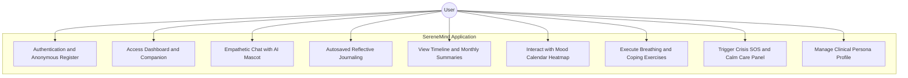
* **Diagram Explanation**: Shows how a user actor interacts with the SereneMind application boundary, including authentication, dashboard management, journaling, mood analytics, coping exercises, crisis interventions, and persona configurations.

### 4.2 System Boundary Context Diagram — DFD Level 0 (Diagram 2)
Maps the high-level boundary of the application, external inputs, and outputs.

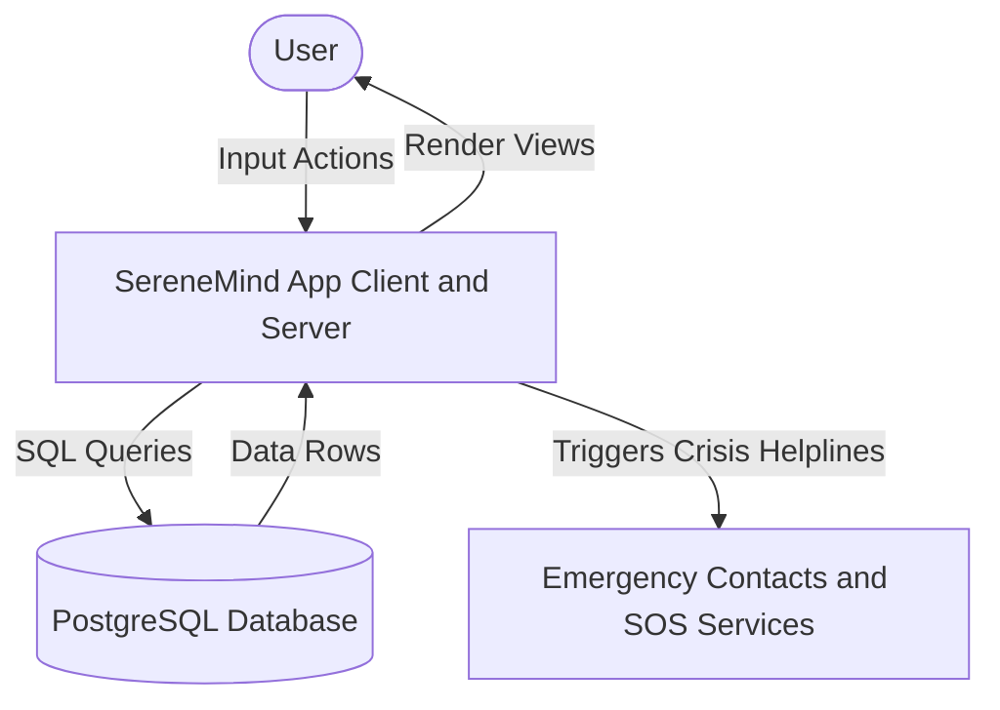
* **Diagram Explanation**: Maps inputs and outputs at the application boundary (DFD Level 0), showing how user interactions process through frontend/backend layers to persist in PostgreSQL and trigger external SOS crisis resources when needed.

### 4.3 Data Flow Diagram — DFD Level 1 (Diagram 3)
Illustrates how data flows across major logical processes and tables in PostgreSQL.

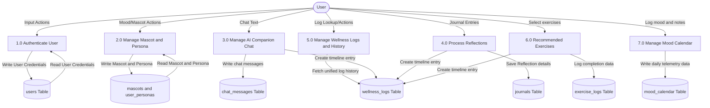
* **Diagram Explanation**: Traces data paths (DFD Level 1) showing how user credentials, journal bodies, chat messages, mood heatmaps, and exercises read/write to tables (`users`, `mascots`, `journals`, `chat_messages`, etc.) and automatically update `wellness_logs`.

### 4.4 Authentication Sequence Diagram (Diagram 4)
Walks through the user registration and login token validation mechanisms.

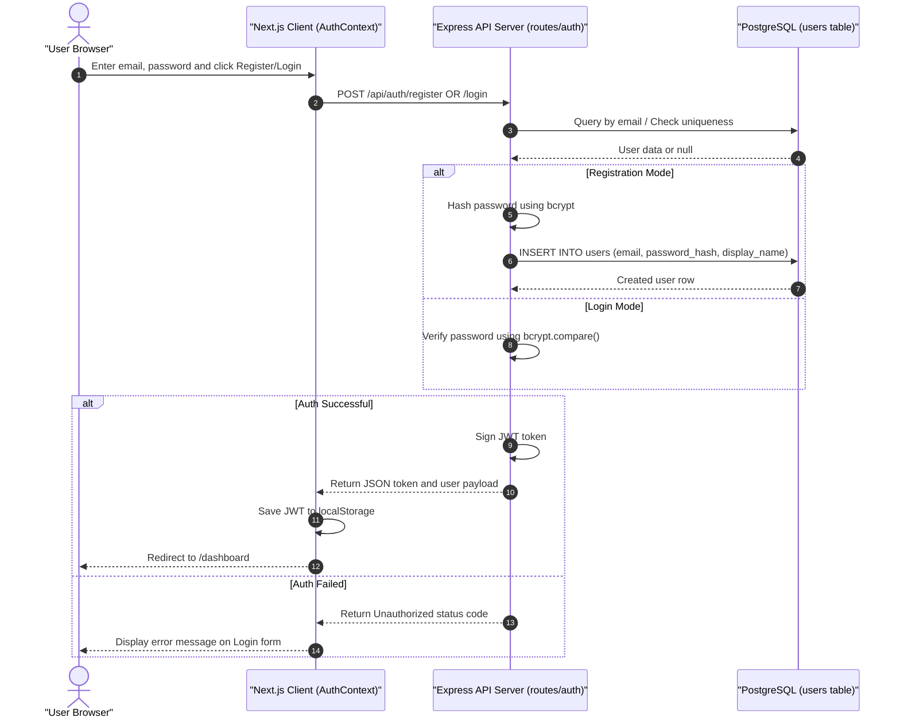
* **Diagram Explanation**: Shows the sequence of register/login requests. A user submits credentials, the Express backend verifies/hashes the password using bcrypt, queries database entries, signs a JWT session token, and updates local browser states.

### 4.5 Chatbot Conversation Sequence Diagram (Diagram 5)
Details how user chats with Sparky are saved and tracked.

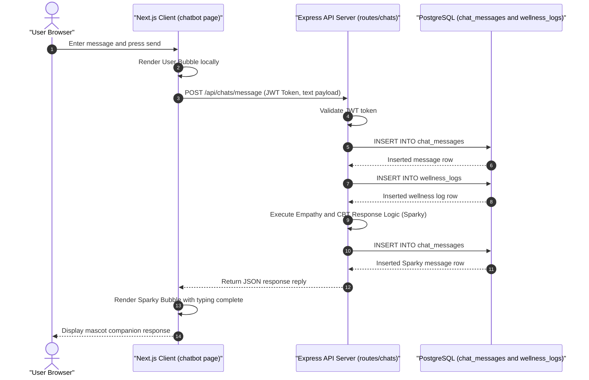
* **Diagram Explanation**: Illustrates the RAG/chat response loop. Messages from the client are saved in `chat_messages` and synced with `wellness_logs` timeline entries before the Mascot replies with an empathetic response.

### 4.6 Journal Reflection & Sentiment Sequence Diagram (Diagram 6)
Tracks the debounced journaling flow and automated sentiment logging.

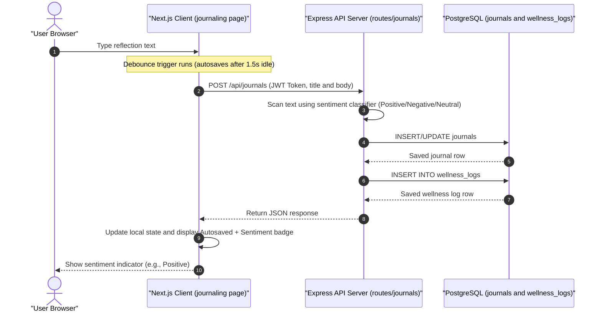
* **Diagram Explanation**: Models the debounced journaling pipeline. Typing events wait for 1.5s client-side inactivity, POST to the server to compute text sentiments, upsert records in journals and timeline logs, and return status indicators.

### 4.7 Daily Streak Calculation Sequence Diagram (Diagram 7)
Illustrates how the daily streak is computed backward from the user's current calendar date.

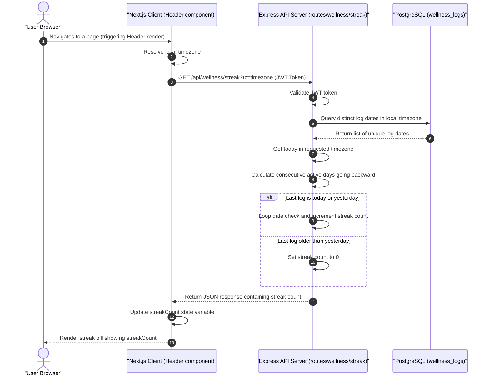
* **Diagram Explanation**: Outlines timezone-aware streak tracking. Client mounts trigger calls passing local offsets, and the server queries unique database entry dates in that offset to count consecutive daily activity backwards.

### 4.8 System Class Diagram — Domain Models (Diagram 8)
Maps the relationship models of all tables in the `serenemind` database.

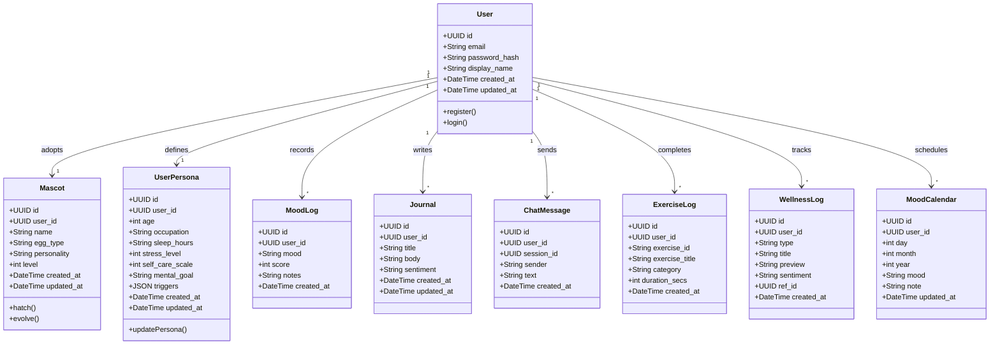
* **Diagram Explanation**: Models the PostgreSQL domain schema using class models. It demonstrates the relational entities (`User`, `Mascot`, `UserPersona`, `MoodLog`, `Journal`, `ChatMessage`, `ExerciseLog`, `WellnessLog`, `MoodCalendar`) and defines user adoption, creation, logging, and completion boundaries.

### 4.9 Mascot State Machine Diagram (Diagram 9)
Tracks how Sparky's hatch lifecycle and levels evolve.

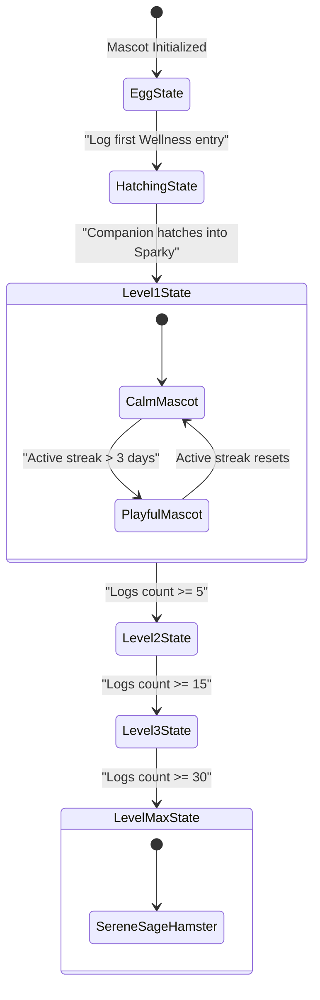
* **Diagram Explanation**: Illustrates Sparky's hatching and development states. Evolution is gated by cumulative log inputs, transitioning from the egg shell graphics, through Hatching, Apprentice, Sensing Companion, and finally Serene Sage status.

### 4.10 User Session State Machine Diagram (Diagram 10)
Identifies authorization lifecycles and transitions during normal vs emergency flows.

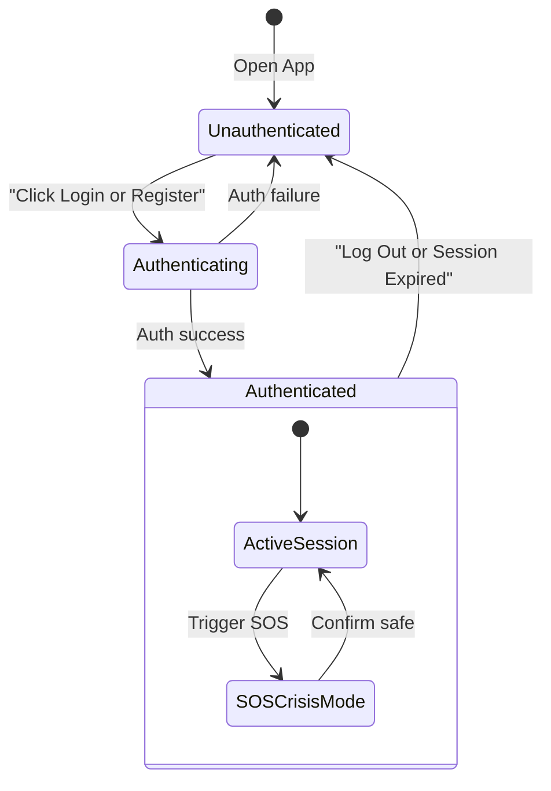
* **Diagram Explanation**: Outlines active authorization states. A user moves from Unauthenticated to Authenticated, entering a secure active session that halts standard response models to display contact references if a high-risk SOS Crisis condition is triggered.

### 4.11 Mood Check-In Activity Diagram (Diagram 11)
Documents step-by-step logic for quick mood logging.

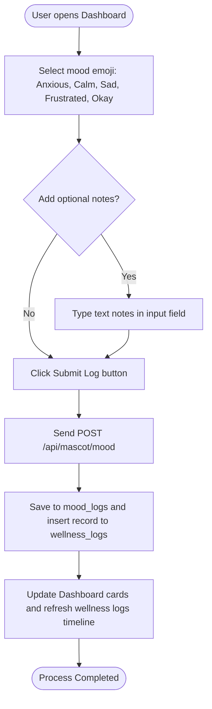
* **Diagram Explanation**: Diagrams the step-by-step logic for quick mood logging. Users tap emoji scores, append voluntary logs, POST details to mascot endpoints, write DB entries, and instantly refresh dashboards.

### 4.12 Journal Autosave Activity Diagram (Diagram 12)
Illustrates logic for debouncing keyboard strokes to prevent database request overloading.

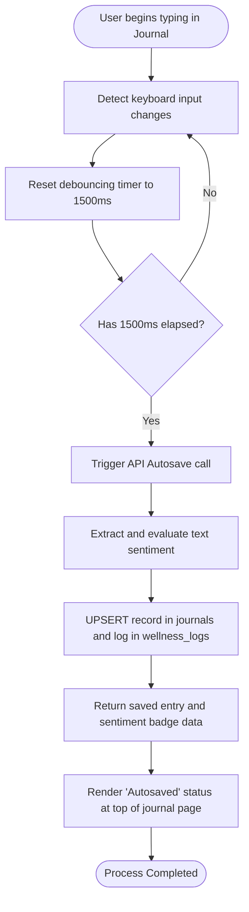
* **Diagram Explanation**: Depicts the debouncing logic that minimizes database workload. Keypresses trigger 1500ms client timers that continuously reset; upon expiration, the client executes autosaves, runs sentiment queries, and sets status badges.

### 4.13 Component Diagram (Diagram 13)
Identifies architectural boundary components and standard interaction flows.

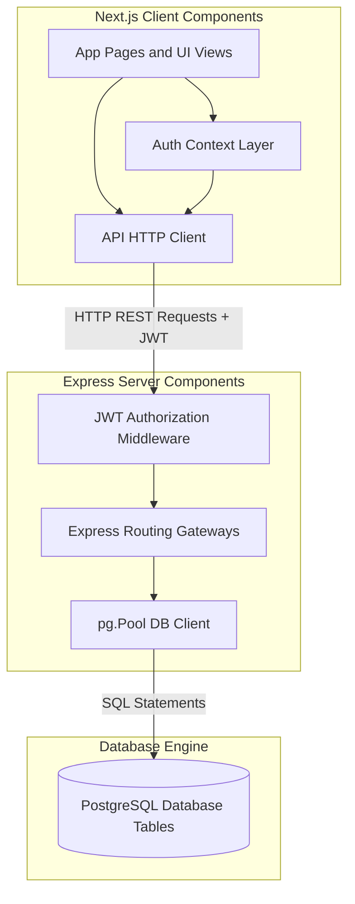
* **Diagram Explanation**: Outlines boundaries between UI views, auth contexts, client HTTP requests, API routes, security/session verification middleware, connection pool clients, and physical database engines.

### 4.14 Deployment Diagram (Diagram 14)
Details server, database containerization, and browser runtimes.

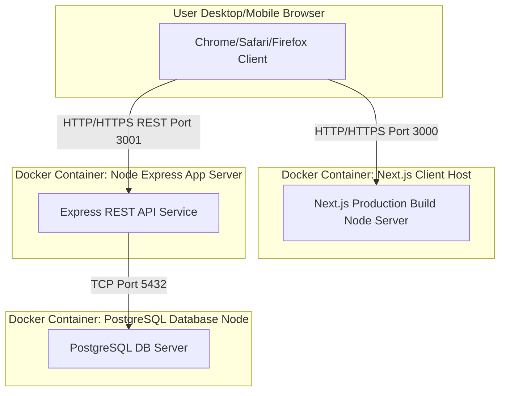
* **Diagram Explanation**: Represents containerized service runtimes. User browsers run local React scripts, communicating on port 3000 to Client Host servers, on port 3001 to Node Express services, and on port 5432 to Postgres engines.

---

## 5. Non-Functional Requirements

### 5.1 Security & Cryptography
- **In-Transit Encryption**: All API interactions enforce HTTPS with TLS 1.3 protocol standards.
- **At-Rest Storage**: Fields containing logs are encrypted with AES-256 keys managed externally.
- **Session Lifecycles**: JWT tokens are signed using a secure `JWT_SECRET` key and set with a 7-day expiration.

### 5.2 Regulatory & Privacy Standards
- **HIPAA**: Audit logging is mapped to track reads/writes of sensitive clinical health profiles in `user_personas` or `wellness_logs`.
- **GDPR**: Account purging routes are configured to execute clean cascades across relational tables upon requests.
- **Anonymity**: User logins support non-personalized accounts, storing zero real-world identity metrics.

### 5.3 Reliability and Performance
- **API Response Latencies**: Target latency for 95% of standard requests is below 200 milliseconds.
- **Timezone Robustness**: Real-time streak tracking dynamically adapts to RESOLVED client location settings, preserving accuracy for global offsets.
