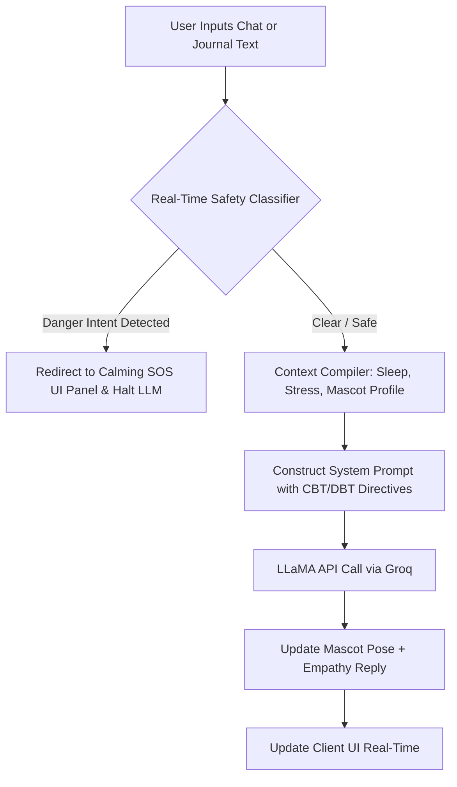

# 🥚 SereneMind — AI-Driven Mental Health Support Ecosystem

> **Empowering mental wellness through secure, real-time AI companionship, Cognitive Behavioral Therapy (CBT) reflection, and evidence-based self-care pacers.**
>
> *Developed for the 2026 AI Mental Health Hackathon.*

---

## 🌟 Executive Summary & Vision

**SereneMind** is a state-of-the-art mental health support application designed to bridge the gap between weekly therapist sessions and daily emotional struggles. By integrating Cognitive Behavioral Therapy (CBT) frameworks, Dialectical Behavior Therapy (DBT) exercises, and advanced sentiment analysis, SereneMind helps users understand their emotional patterns, self-regulate, and build emotional resilience in a secure environment.

> [!IMPORTANT]
> **SereneMind is NOT a clinical tool or a replacement for professional medical treatment.** It is a supportive wellness companion designed to prevent emotional escalation and empower personal reflection.

---

## 🚀 Core Features

### 1. 🤖 Empathetic Mascot Companion (Sparky)
*   Interact with **Sparky**, a personalized wellness companion whose level, traits, and poses (e.g., WAVE, MEDITATE, CELEBRATE) evolve based on your self-care progress.
*   Chat using Cognitive Behavioral Therapy frameworks to work through stressful scenarios.

### 2. 📝 Reflective Journaling Space
*   Write free-form reflections with auto-saving.
*   Receive real-time **AI Sentiment Detection** (e.g., Positive, Anxious, Stressed, Mixed) and personalized CBT-based coping suggestions.

### 3. 🎙️ Continuous Real-Time Voice Dictation
*   Dictate thoughts and reflections hands-free! 
*   Uses the Web Speech API configured for **continuous, real-time transcription** (using `interimResults` to render text instantly as you speak, appending proper punctuation and sentences automatically). The recording only stops when you click to stop.

### 4. 📊 Deep-Dive Mood Analytics
*   **Resilience & Mood Trend Chart**: A self-drawing Bezier curve line chart illustrating your weekly mood progress.
*   **Daily Mood Dynamics Heatmap**: An interactive monthly calendar grid mapping daily mood scores.
*   **Correlation & Lifestyle Factors**: Analytics correlating Screen Time, Sleep, Water Intake, and Physical Activity against your emotional baseline.

### 5. 🗂️ Wellness Timeline & Archive
*   A centralized timeline logging your daily exercises, journals, check-ins, and chats.
*   **Expandable Chat Transcripts**: Review past conversations instantly. Includes an automatic filter that screens out greeting spam, keeping your transcripts focused strictly on your actual reflections.
*   **Generative AI Summaries**: Request monthly or yearly summaries of your emotional logs.

### 6. 🚨 Clinical Safety & Crisis SOS System (The Sentinel)
*   **Real-time Classification**: Every message is scanned for severe clinical danger triggers (e.g., suicide, self-harm, eating disorders).
*   **Instant Intercept**: If a trigger is detected, standard AI replies are instantly halted, and the UI transitions to a dedicated, calming **Crisis SOS panel** displaying local emergency help resources (988 helpline, text line, geo-based numbers).

---

## 📐 System Architecture & Data Flow

Every prompt sent to the LLM is pre-evaluated by the backend for security and contextual alignment.



### Technical Stack
*   **Frontend**: React (Next.js App Router), Custom HSL Glassmorphism CSS system, Web Speech API.
*   **Backend**: Node.js, Express, TypeScript.
*   **Database**: PostgreSQL (handling users, journals, check-ins, and timelines).
*   **AI Integration**: Groq API hosting high-performance LLaMA models for real-time sentiment analysis, CBT prompts, and monthly summary generation.

---

## 🛠️ Installation & Local Setup

Get SereneMind up and running in less than 3 minutes using the automated startup scripts.

### Prerequisites
*   [Node.js](https://nodejs.org/) (v18 or higher)
*   [PostgreSQL](https://www.postgresql.org/) (v14 or higher)

### 1. Clone & Set Up Server Environment
1. Clone the repository and navigate to the project directory.
2. In the `server` directory, create a `.env` file based on `.env.example`:
   ```bash
   DATABASE_URL=postgresql://localhost:5432/serenemind
   JWT_SECRET=your_super_secret_jwt_key
   PORT=3001
   NODE_ENV=development
   GROQ_API_KEY=your_groq_api_key
   ```

### 2. Run the App
SereneMind includes a unified startup script (`start.sh`) that checks PostgreSQL status, creates the database if it doesn't exist, runs database migrations, and launches both development servers in parallel.

Make the script executable and run it from the root:
```bash
chmod +x start.sh
./start.sh
```

### 3. Verification Endpoints
*   **Next.js Frontend**: [http://localhost:3000](http://localhost:3000)
*   **Express API Server**: [http://localhost:3001](http://localhost:3001)
*   **Health Status**: [http://localhost:3001/health](http://localhost:3001/health)

---

## 🛡️ Security, Privacy & Compliance
*   **HIPAA Principles**: Direct field-level database sanitization to scrub personal identifiers, and strict separation of API credentials.
*   **User Controls**: Absolute data clearing options on demand. Journals and chats are private to the session and never stored for global training.
